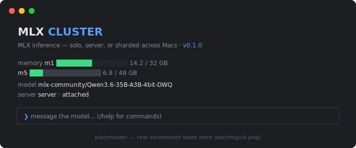

<div align="center">

# mac-mlx-cluster

**Two Macs. One Thunderbolt cable. Zero cloud.**

Run LLMs on Apple Silicon with [MLX](https://github.com/ml-explore/mlx) — on one Mac,
or sharded across two when the model is too big for either.

[](./LICENSE)


<!-- Real screenshot: save as doc/img/cli.png and change the src below -->


</div>

```
   ┌──────────────────────┐                          ┌──────────────────────┐
   │   M5 Pro · 48 GB     │      Thunderbolt 4       │   M1 Pro · 32 GB     │
   │   dev machine        │◀────────────────────────▶│   always-on server   │
   │   mlx-cluster-cli    │      10.0.0.0/24         │   mlx_lm.server      │
   └──────────────────────┘                          └──────────────────────┘

   solo     one Mac serves the whole model — the other stays 100% free
   server   the M1 serves over the bridge — chat from anywhere on it
   cluster  one model tensor-sharded across BOTH Macs (/mode cluster)
            → 80 GB of combined unified memory for models neither can hold alone
```

## Why this exists

A weekend 1–3 AM side project — the question that kept me up: *could two
idle Macs run one LLM together?* Answered first with
[exo](https://github.com/exo-explore/exo), then the MLX-native way via
[WWDC 2026 session 233](https://developer.apple.com/videos/play/wwdc2026/233/)'s
`mlx.launch`, and finally wrapped in a real terminal CLI. Every command in
[`doc/CLUSTER_SETUP.md`](./doc/CLUSTER_SETUP.md) was run for real, failures
included — that's where the gotchas sections come from.

## What's in the box

| | |
|---|---|
| **`mlx-cluster-cli`** | Terminal chat client + cluster operator: live CPU/GPU/RAM bars for both Macs, in-session model switching, wear-leveling so one machine doesn't take all the load, and `/mode cluster` to shard an oversized model across both — without leaving your chat. |
| **`mlxctl`** | The model-cache manager `hf` should have shipped with: true on-disk sizes, per-shard download progress, stuck-download rescue, and a will-it-fit verdict against your Mac's real wired-memory ceiling. |
| **Verified guides** | Single-Mac quickstart → Thunderbolt bridge → SSH mesh → distributed smoke test → always-on LaunchAgent server. Each step actually run on the hardware in the diagram above. |

Only the cluster pieces need two Macs — the quickstart and `mlxctl` are fully
standalone on a single Apple Silicon machine.

## Quick start

> Requires an Apple Silicon Mac and Python 3.12+. A second Mac + a Thunderbolt
> cable only matter for the cluster features.

```sh
python3.12 -m venv ~/.venvs/mlx
~/.venvs/mlx/bin/pip install mlx-lm
export PATH="$HOME/.venvs/mlx/bin:$PATH"   # add to ~/.zshenv to persist

mlx_lm.chat --model mlx-community/Qwen3.5-9B-4bit --max-tokens 2048
```

That's a local LLM, chatting, on one Mac. Details in
[`doc/MLX_QUICKSTART.md`](./doc/MLX_QUICKSTART.md); when you're ready for the
second Mac, [`doc/CLUSTER_SETUP.md`](./doc/CLUSTER_SETUP.md) takes it from here.

## `mlxctl` — tame the model cache

```sh
ln -s "$PWD/src/tools/mlxctl" ~/.venvs/mlx/bin/mlxctl
```

| Command | What it does |
|---------|--------------|
| `mlxctl list` | All cached models with true size + status — counts in-progress downloads `hf cache list` can't see |
| `mlxctl status <repo>` | Per-shard download progress for one model |
| `mlxctl download <repo>` | Download a model (refuses to start a second copy of a running one) |
| `mlxctl search <query>` | Search `mlx-community` on the Hub |
| `mlxctl run <repo> [args]` | Launch `mlx_lm.chat` — repo accepts a unique substring, e.g. `mlxctl run 9b` |
| `mlxctl meminfo [repo]` | This Mac's wired-memory ceiling + a fits / tight / won't-fit verdict |
| `mlxctl clean [repo]` | Kill a stuck download, clear stale locks, drop stale partials — never touches complete files |
| `mlxctl remove <repo>` | Delete a model from the cache entirely |
| `mlxctl server <start\|stop\|status>` | Drive the cluster's LaunchAgent server, locally or over SSH |

Optional env vars: `MLX_VENV` (default `~/.venvs/mlx`) and `HF_HOME`
(default `~/.cache/huggingface`).

## Running the cluster

[`doc/CLUSTER_SETUP.md`](./doc/CLUSTER_SETUP.md) is the full verified
walkthrough — bridge IPs, SSH mesh, hostfile, smoke test, LaunchAgent. Once
it's up, `mlx-cluster-cli` handles daily driving, including the sharded mode
that used to require hand-typed `mlx.launch` incantations:

```
/mode solo       serve on this Mac only, free the server node
/mode cluster    shard the model across every node — for the big ones
/model 27b       hot-swap models by substring, whatever the mode
/split 60/40     wear-leveling: balance which Mac serves over time
```

Direct server access, if you want it raw (server Mac = `10.0.0.1`):

```sh
curl -s http://10.0.0.1:8080/v1/models                                     # health check
ssh <user>@10.0.0.1 'launchctl kickstart -k gui/$(id -u)/com.mlx-server'   # restart
python3 src/tools/chat.py                                                  # debug/test client
```

## Development

```sh
~/.venvs/mlx/bin/pip install -r src/tools/requirements.txt -r src/tools/requirements-dev.txt
ruff check src/tools/mlxctl      # lint
ruff format src/tools/mlxctl     # format
```

For the TypeScript CLI (Bun + Ink), see [`src/cli/README.md`](./src/cli/README.md).

## Documentation

| Doc | What it covers |
|-----|----------------|
| [`doc/ARCHITECTURE.md`](./doc/ARCHITECTURE.md) | The system-level reference: topology, data flow, and *why* the design is shaped this way |
| [`doc/MLX_QUICKSTART.md`](./doc/MLX_QUICKSTART.md) | Single Mac, zero to chatting |
| [`doc/CLUSTER_SETUP.md`](./doc/CLUSTER_SETUP.md) | The two-Mac walkthrough, every command verified, gotchas included |
| [`doc/ROADMAP.md`](./doc/ROADMAP.md) | Planned but not-yet-built work |
| [`src/cli/README.md`](./src/cli/README.md) | `mlx-cluster-cli` setup, commands, error handling |
| [`src/tools/`](./src/tools/) | `mlxctl`, the distributed benchmark (`dist_bench.py`), the zero-dep debug client (`chat.py`), example configs |

## License

[MIT](./LICENSE)
