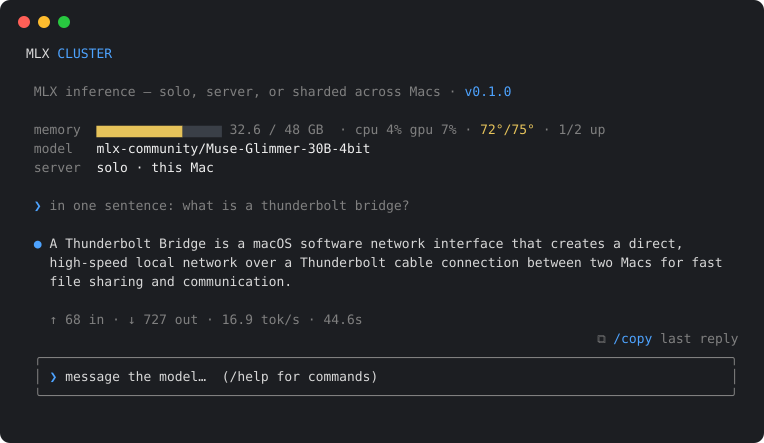

<div align="center">

# mac-mlx-cluster

**Two Macs. One Thunderbolt cable. Zero cloud.**

Run LLMs on Apple Silicon with [MLX](https://github.com/ml-explore/mlx) — solo on
one Mac, or pooled across two for models neither can hold alone.

[](./LICENSE)


[](https://github.com/ml-explore/mlx)

<!-- Real screenshot: save as doc/img/cli.png and change the src below -->


</div>

## Why this exists

A weekend 1–3 AM side project, built after watching
[WWDC 2026 session 233](https://developer.apple.com/videos/play/wwdc2026/233/)
to see if my aging M1 Pro could pull its weight next to a newer Mac.
[exo](https://github.com/exo-explore/exo) proved it possible, but its
auto-discovery and web dashboard are overkill for two Macs whose IPs I
already know — `mlx.launch` does the same job MLX-native with a fraction
of the moving parts, wrapped here in a proper terminal CLI. It then kept
growing: once the models were being served anyway, the obvious next step
was pointing a coding agent at them, built straight into the chat client
(`/agent`). Every command in
[`doc/CLUSTER_SETUP.md`](./doc/CLUSTER_SETUP.md) was run for real,
failures included — that's where the gotchas sections come from.

```
   ┌──────────────────────┐                          ┌──────────────────────┐
   │   M5 Pro · 48 GB     │      Thunderbolt 4       │   M1 Pro · 32 GB     │
   │   dev machine        │◀────────────────────────▶│   always-on server   │
   │   mlx-cluster        │      10.0.0.0/24         │   mlx_lm.server      │
   └──────────────────────┘                          └──────────────────────┘

   solo     one Mac serves the whole model — the other stays 100% free
            (set defaultMode: "solo" to start here without probing the server)
   server   the M1 serves over the bridge — chat from anywhere on it
   cluster  one model tensor-sharded across BOTH Macs (/mode cluster)
            → 80 GB of combined unified memory for models neither can hold alone
```

> Everything here — guides, `mlxctl`, `mlx-cluster` — is built and tested against
> exactly two Macs, the pair in the diagram above. `mlx.launch`/MLX's
> distributed layer isn't inherently limited to two nodes, so a larger,
> N-Mac cluster is plausible in principle, but it's untested and unimplemented
> here (hostfile generation, `/mode`, and wear-leveling all assume two nodes).
> Fork it and adapt as needed if that's your use case.

## What's in the box

- **`mlx-cluster`** — terminal chat client + cluster operator, one session
  for everything:
  - `/mode solo|server|cluster` — switch how the model is served
    mid-session: this Mac alone, the always-on server, or tensor-sharded
    across both. No restart, no leaving the chat.
  - `/model` — list what's cached on the serving node and switch, with a
    memory-fit verdict against the Mac's real wired-memory ceiling before
    anything loads.
  - `/agent <dir>` — a built-in coding agent scoped to one directory,
    running entirely on your own model: read/write/shell tools, y/N
    confirmation before writes and commands, no cloud round-trips.
  - `/stats` and `/split 60/40` — live per-node CPU/GPU/RAM/temp gauges,
    and wear-leveling that balances serving time so one Mac doesn't
    quietly take all the GPU wear.
  - **Token accounting on every reply** — `↑ 82 in · ↓ 422 out · 17.1 tok/s
    · 25.1s`, taken from the server's own usage counters rather than
    estimated. Reasoning tokens are counted too, so a thinking model's real
    cost is visible instead of hidden.
  - **Text *and* vision models** — picks `mlx_lm` or `mlx_vlm` per model
    automatically, so VLM-only architectures just work instead of failing
    on the first message.
- **`mlxctl`** — the model-cache manager `hf` should have shipped with: true
  on-disk sizes, per-shard download progress, stuck-download rescue, a
  will-it-fit verdict (`mlxctl meminfo`), and one-command server control
  (`mlxctl server start|stop|status`) that works the same whether you're on
  the server Mac or not.
- **Verified guides** — single-Mac quickstart → Thunderbolt bridge → SSH mesh →
  distributed smoke test → always-on LaunchAgent server, each step actually
  run on the hardware in the diagram above.

Only the cluster pieces need two Macs — everything else works standalone on a
single Apple Silicon machine. And zero cloud, ever: every request stays on
the Thunderbolt bridge or localhost.

## What to expect

Generation on Apple Silicon is **memory-bandwidth bound, not compute
bound**: a dense model reads essentially all its weights per token, so
speed ≈ bandwidth ÷ weight size. Measured on an M5 Pro (48 GB), 4-bit,
single Mac:

| Model | Weights | tok/s |
|---|---|---|
| Qwen2.5-VL-7B | 5.3 GB | 65 |
| Qwen3.5-9B | 5.6 GB | 52 |
| Muse-Glimmer-30B (default) | 19.3 GB | 17 |

All three land at ~290–345 GB/s of effective bandwidth — that consistency
is the point. A large dense model running slowly is physics, not a
misconfiguration, and **clustering won't fix it**: sharding pools *memory*,
not bandwidth, and adds a per-layer round trip over a link ~60× slower than
local memory. Want more speed? Pick a smaller model, or an MoE (which reads
only a fraction of its weights per token). Want a model that fits in
neither Mac alone? *That's* what cluster mode is for.

The default chat model is
[`Muse-Glimmer-30B-4bit`](https://huggingface.co/mlx-community/Muse-Glimmer-30B-4bit)
— 30B dense, multimodal, Apache 2.0, built for tool use and long agent
tasks. It runs under `mlx_vlm`, so `pip install -U mlx-vlm` if you want it;
any `mlx-lm` text model works too and the CLI routes accordingly.

## Quick start

> Requires an Apple Silicon Mac and Python 3.12+. A second Mac + a Thunderbolt
> cable only matter for the cluster features.

```sh
# 1. Get the code
git clone https://github.com/MKS-01/mac-mlx-cluster.git && cd mac-mlx-cluster

# 2. MLX venv — where the models and servers run
python3.12 -m venv ~/.venvs/mlx
~/.venvs/mlx/bin/pip install mlx-lm          # add mlx-vlm too for vision models
export PATH="$HOME/.venvs/mlx/bin:$PATH"     # add to ~/.zshenv to persist

# 3. First chat — downloads ~5 GB of weights on first run, then loads from cache
mlx_lm.chat --model mlx-community/Qwen3.5-9B-4bit --max-tokens 2048
```

That's a local LLM, chatting, on one Mac. From there, the two tools in the box:

```sh
# mlxctl — model-cache manager (then: mlxctl --help)
ln -s "$PWD/src/tools/mlxctl" ~/.venvs/mlx/bin/mlxctl

# mlx-cluster — the chat client in the screenshot (needs https://bun.sh)
cd src/cli && ./install.sh                   # deps + standalone binary → ~/.local/bin
mlx-cluster                                  # solo mode — works fine on one Mac
```

`install.sh` does the whole thing: `bun install`, compiles a self-contained
binary (Bun runtime included), installs it to `~/.local/bin` (override with
`MLX_CLI_BIN_DIR`), warns if that's not on your `PATH`, and reminds you to
create `~/.mlx/cluster-cli.json` from `config.example.json` for the two-Mac
setup. Re-run it after pulling new changes. (`bun run setup` is the same
script.)

When you're ready for the second Mac, the whole cluster build — bridge IPs
through the always-on server — lives in
[`doc/CLUSTER_SETUP.md`](./doc/CLUSTER_SETUP.md).

## Documentation

- [`doc/CLUSTER_SETUP.md`](./doc/CLUSTER_SETUP.md) — the full verified
  walkthrough: single Mac zero-to-chatting, then bridge IPs, SSH mesh,
  hostfile, smoke test, and the always-on LaunchAgent server — ends with a
  go-to command cheatsheet grouped by task.
- [`doc/ARCHITECTURE.md`](./doc/ARCHITECTURE.md) — the system-level reference:
  a full-system flowchart, topology, data flow, and *why* the design is shaped
  this way (also where the Python-side dev/lint commands live).
- [`src/cli/README.md`](./src/cli/README.md) — `mlx-cluster`'s own setup and
  command reference for daily driving: `/mode`, `/model`, `/agent`, `/split`,
  and the rest.

## License

[MIT](./LICENSE)
