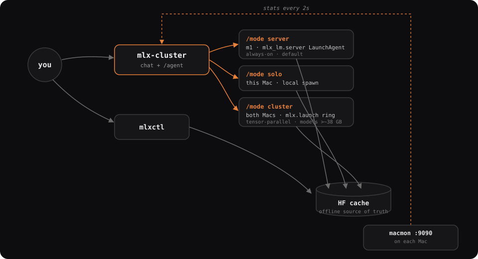

<div align="center">

# mac-mlx-cluster

**Two Macs. One Thunderbolt cable. Zero cloud.**

Run LLMs on Apple Silicon with [MLX](https://github.com/ml-explore/mlx) — solo on
one Mac, or pooled across two for models neither can hold alone.

[](./LICENSE)


[](https://github.com/ml-explore/mlx)

<p>
  <a href="./doc/ARCHITECTURE.md">How it fits together</a> &nbsp;·&nbsp;
  <a href="./doc/CLUSTER_SETUP.md">Full setup guide</a> &nbsp;·&nbsp;
  <a href="#quick-start">Run it</a>
</p>

</div>

---

## Why this exists

A weekend 1–3 AM side project, built after watching
[WWDC 2026 session 233](https://developer.apple.com/videos/play/wwdc2026/233/)
to see if my aging M1 Pro could pull its weight next to a newer Mac.
[exo](https://github.com/exo-explore/exo) proved it possible, but its
auto-discovery and web dashboard are overkill for two Macs whose IPs I
already know — `mlx.launch` does the same job MLX-native with a fraction of
the moving parts, wrapped here in a proper terminal CLI.

It then kept growing: once the models were being served anyway, the obvious
next step was pointing a coding agent at them, built straight into the chat
client (`/agent`). Every command in
[`doc/CLUSTER_SETUP.md`](./doc/CLUSTER_SETUP.md) was run for real, failures
included — that's where the gotchas sections come from.

## How it works

<p align="center">
  
</p>

One CLI, three ways to serve the same model, one shared cache underneath.
`/mode` picks:

- **server** — the M1 Pro's always-on `mlx_lm.server`. The default.
- **solo** — this Mac serves itself, the other stays 100% free. Set
  `defaultMode: "solo"` to start here without even probing the server.
- **cluster** — both Macs tensor-sharded over Thunderbolt (`/mode cluster`),
  for the ~80 GB of combined unified memory models neither Mac can hold alone.

`mlxctl` manages the same on-disk cache from either side. This is the
five-minute picture — [`doc/ARCHITECTURE.md`](./doc/ARCHITECTURE.md) has the
full flowchart, the two serving patterns, measured throughput, and *why*
each decision is shaped the way it is.

<details>
<summary>Does this work with more than two Macs?</summary>

<br>

Everything here — guides, `mlxctl`, `mlx-cluster` — is built and tested against
exactly two Macs, the pair in the diagram above. `mlx.launch`/MLX's
distributed layer isn't inherently limited to two nodes, so a larger,
N-Mac cluster is plausible in principle, but it's untested and unimplemented
here (hostfile generation, `/mode`, and wear-leveling all assume two nodes).
Fork it and adapt as needed if that's your use case.

</details>

## What's in the box

**`mlx-cluster`** — terminal chat client *and* cluster operator, one session
for everything ([full command reference](./src/cli/README.md)):

| | |
|---|---|
| `/mode solo\|server\|cluster` | Switch how the model is served mid-session — this Mac alone, the always-on server, or tensor-sharded across both. No restart, no leaving the chat. |
| `/model` | List what's cached on the serving node and switch, with a memory-fit verdict against the Mac's real wired-memory ceiling *before* anything loads. |
| `/agent <dir>` | A coding agent scoped to one directory, running entirely on your own model: read/write/shell tools, y/N confirmation before writes and commands, no cloud round-trips. |
| `/stats` · `/split 60/40` | Live per-node CPU/GPU/RAM/temp gauges, plus wear-leveling that balances serving time so one Mac doesn't quietly take all the GPU wear. |
| **Token accounting** | Every reply ends with `↑ 82 in · ↓ 422 out · 17.1 tok/s · 25.1s` — the server's own counters, not an estimate. Reasoning tokens included, so a thinking model's real cost is visible. |
| **Text *and* vision** | Picks `mlx_lm` or `mlx_vlm` per model automatically, so VLM-only architectures just work instead of failing on the first message. |

**`mlxctl`** — the model-cache manager `hf` should have shipped with: true
on-disk sizes, per-shard download progress, stuck-download rescue, a
will-it-fit verdict (`mlxctl meminfo`), and one-command server control
(`mlxctl server start|stop|status`) that works the same whether you're on
the server Mac or not.

**Verified guides** — single-Mac quickstart → Thunderbolt bridge → SSH mesh →
distributed smoke test → always-on LaunchAgent server, each step actually
run on a real M1 Pro / M5 Pro pair.

Only the cluster pieces need two Macs — everything else works standalone on a
single Apple Silicon machine. And zero cloud, ever: every request stays on
the Thunderbolt bridge or localhost.

## What to expect

- **Bandwidth-bound, not compute-bound.** A dense model reads essentially all
  its weights per token, so speed ≈ bandwidth ÷ weight size — every model
  measured here lands around the same ~290–330 GB/s regardless of size. A
  large dense model running slowly is physics, not a misconfiguration.
- **Clustering won't fix a slow model.** Sharding pools *memory*, not
  bandwidth, and adds a per-layer round trip over a link ~60× slower than
  local memory. Want more speed? Pick a smaller model, or an MoE (which reads
  only a fraction of its weights per token). Want a model that fits in
  neither Mac alone? *That's* what cluster mode is for.
- **Direct mode beats `/mode ollama` on speed, same model.** Measured on an
  M5 Pro, `Muse-Glimmer-30B-4bit`, warm, `curl` straight at each server's API
  (client out of the equation): `mlx_vlm.server` ~16.9 tok/s vs. Ollama's own
  MLX runner ~14.8 tok/s — its OpenAI-compat translation layer costs roughly
  12–15% here. The CLI itself has zero effect on speed either way; it's a
  thin HTTP client. `/mode ollama` earns its keep for reuse instead — a model
  you already `ollama pull`ed, without downloading it again into the HF
  cache — not for speed.
- **Default model:**
  [`Muse-Glimmer-30B-4bit`](https://huggingface.co/mlx-community/Muse-Glimmer-30B-4bit) —
  30B dense, multimodal, Apache 2.0, built for tool use and long agent tasks.
  Runs under `mlx_vlm` (`pip install -U mlx-vlm`); any `mlx-lm` text model
  works too and the CLI routes accordingly.

## Quick start

> Requires an Apple Silicon Mac and Python 3.12+. A second Mac + a Thunderbolt
> cable only matter for the cluster features.

```sh
# 1. Get the code
git clone https://github.com/MKS-01/mac-mlx-cluster.git && cd mac-mlx-cluster

# 2. MLX venv — where the models and servers run
python3.12 -m venv ~/.venvs/mlx
~/.venvs/mlx/bin/pip install mlx-lm          # add mlx-vlm too for vision models
export PATH="$HOME/.venvs/mlx/bin:$PATH"     # add to ~/.zshenv to persist

# 3. First chat — downloads ~5 GB of weights on first run, then loads from cache
mlx_lm.chat --model mlx-community/Qwen3.5-9B-4bit --max-tokens 2048
```

That's a local LLM, chatting, on one Mac. From there, the two tools in the box:

```sh
# mlxctl — model-cache manager (then: mlxctl --help)
ln -s "$PWD/src/tools/mlxctl" ~/.venvs/mlx/bin/mlxctl

# mlx-cluster — the chat client (needs https://bun.sh)
cd src/cli && ./install.sh                   # deps + standalone binary → ~/.local/bin
mlx-cluster                                  # solo mode — works fine on one Mac
```

<details>
<summary>What <code>install.sh</code> actually does</summary>

<br>

`bun install`, compiles a self-contained binary (Bun runtime included),
installs it to `~/.local/bin` (override with `MLX_CLI_BIN_DIR`), warns if
that's not on your `PATH`, and reminds you to create
`~/.mlx/cluster-cli.json` from `config.example.json` for the two-Mac setup.
Re-run it after pulling new changes. (`bun run setup` is the same script.)

</details>

When you're ready for the second Mac, the whole cluster build — bridge IPs
through the always-on server — lives in
[`doc/CLUSTER_SETUP.md`](./doc/CLUSTER_SETUP.md).

## License

[MIT](./LICENSE)

<div align="center">

<sub>A personal project — built to see if an aging M1 Pro could still pull its weight next to a newer Mac</sub><br>
<sub>Built agent-first with <a href="https://claude.ai/code">Claude Code</a></sub>

</div>
