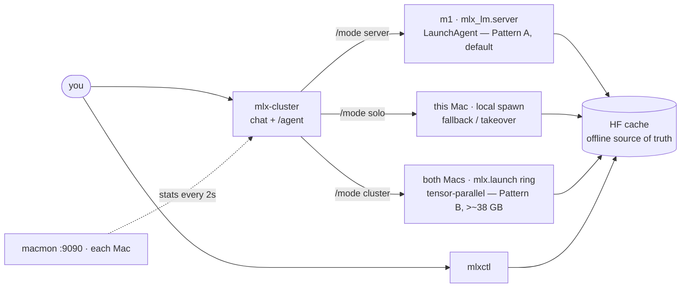

# Architecture

System-level reference: what talks to what, where state lives, and why the
non-obvious decisions were made. For step-by-step setup — single-Mac basics
through the full two-Mac cluster — see
[`CLUSTER_SETUP.md`](./CLUSTER_SETUP.md).

## How it all fits together



Everything below unpacks this picture layer by layer: hardware, the two
serving patterns, each tool, and the decisions that route between them.

## Hardware topology

Two Macs joined by a direct Thunderbolt cable (macOS's `bridge0` interface,
static IPs on top):

| Node | Role | Model | RAM | IP (bridge) |
|---|---|---|---|---|
| **m1** | server (always-on) | M1 Pro | 32 GB | `10.0.0.1` |
| **m5** | dev / peer | M5 Pro (faster) | 48 GB | `10.0.0.2` |

No Wi-Fi/LAN dependency for cluster traffic — everything (SSH, the model
API, macmon stats, distributed `mlx.launch` jobs) rides the Thunderbolt
bridge. RDMA/JACCL is the better-performing backend and would be the
default choice if both nodes supported it, but it needs Thunderbolt 5 on
*every* node — the M1 Pro here only has TB4, so this particular pair can't
reach it regardless of cable. Distributed jobs use the `ring` (TCP) backend
instead; see `CLUSTER_SETUP.md`'s "Backend choice" for the full tradeoff.

## Two serving patterns

**Pattern A — dedicated server (default, what's actually running).** The m1
runs `mlx_lm.server` as a LaunchAgent (`com.mlx-server`, offline-mode via
`HF_HUB_OFFLINE=1`), always on, bound to the bridge IP only. The m5 (or any
client) talks to it as a plain OpenAI-compatible REST API. No sharding — one
Mac holds the whole model, the other's memory stays 100% free.

**Pattern B — tensor-parallel sharding**, only for models too big for one
Mac (>~38 GB). Launched via `mlx.launch --backend ring` across both nodes —
either manually (`CLUSTER_SETUP.md` §7) or from inside the CLI via
`/mode cluster` (below).
Aggregates *memory*, not speed — sharding a model that already fits on one
Mac makes it slower, so Pattern A is preferred whenever the model fits.
**Uneven splits (60/40, 55/45) are not possible at the tensor-parallel
level** — ranks always get equal shares, model dims must divide by rank
count, and forcing an uneven split via multiple ranks per GPU caused Metal
timeouts on the M1 in testing. This is why the CLI's wear-leveling feature
(below) balances *which Mac serves whole*, not *how the model is split*.

## Measured throughput (m5, 2026-08-16)

Generation on a Mac is **memory-bandwidth bound**, not compute bound: a
dense model reads essentially all of its weights per token, so tok/s falls
out of `effective bandwidth ÷ weight size`. Measured on the m5 (M5 Pro,
48 GB), all 4-bit, single Mac, text-only:

| Model | Weights | Server | tok/s | × implied bandwidth |
|---|---|---|---|---|
| Qwen2.5-VL-7B-Instruct | 5.3 GB | `mlx_vlm` | 65.1 | ~345 GB/s |
| Qwen3.5-9B | 5.6 GB | `mlx_lm` | 52.3 | ~293 GB/s |
| **Muse-Glimmer-30B** (default) | 19.3 GB | `mlx_vlm` | 17.1 | ~330 GB/s |

The right-hand column is the diagnostic: every model lands in the same
~290–345 GB/s band, which is what "saturating memory bandwidth" looks
like. A model sitting well *below* the band while smaller ones sit at the
top of it is the signal that something is actually wrong (usually paging
past the wired-memory ceiling — see `mlxctl meminfo` above). A big dense
model being slow, on its own, is not.

Consequences worth internalizing before chasing a slowdown:

- **Sharding cannot fix this.** Pattern B aggregates memory, not
  bandwidth, and adds a per-layer all-reduce over Thunderbolt 4 (~5 GB/s)
  against local memory's ~300 GB/s — roughly 60× slower — while running at
  the pace of the slowest rank.
- **MoE beats dense at equal size.** `Qwen3.6-35B-A3B` is nominally
  *larger* than Muse but activates ~3B params/token, so it reads a
  fraction of the weights per token. That's why it's the `agentModel`
  default: an agent loop is many short tool rounds, where per-token speed
  dominates.
- To go faster, change the model's shape (smaller, or MoE) — not the
  topology.

## `src/tools/mlxctl` — model cache manager

Standalone Python script (no deps beyond `huggingface_hub`), symlinked into
`~/.venvs/mlx/bin`. Manages `~/.cache/huggingface/hub` with incomplete-aware
status (`hf cache list` only counts finished files; `mlxctl list`/`status`
also see in-progress downloads). This cache is shared and load-bearing:
both `mlx_lm.server` (offline mode) and the CLI's `/model` command treat
"what's in this cache" as the hard source of truth for what can be served.

Dev loop:

```sh
~/.venvs/mlx/bin/pip install -r src/tools/requirements.txt -r src/tools/requirements-dev.txt
ruff check src/tools/mlxctl      # lint
ruff format src/tools/mlxctl     # format
```

### Commands

| Command | What it does |
|---|---|
| `list` (`ls`) | Every cached repo, true on-disk size (via `real_size`, which sums resolved blobs including `.incomplete` temp files), and a complete/incomplete/partial/downloading status derived from `completeness()`. |
| `status` (`st`) `<repo>` | Per-shard detail for one repo: which files `model.safetensors.index.json`'s `weight_map` expects, which are actually present, and how many stale `.incomplete` blobs remain. |
| `download <repo>` | `os.execv`s straight into `hf download <repo>` (replaces the `mlxctl` process rather than wrapping it, so Ctrl+C semantics are `hf`'s own). Refuses to start if `downloading_pid()` (a `pgrep` on the `hf download` command line) already finds one running for that repo. |
| `remove` (`rm`) `<repo>` | Deletes the repo's entire cache directory and its lock dir. The only command that touches complete files — deliberately separate from `clean` so a stuck download can be cleared without risking a finished model. |
| `clean [repo]` | With a repo: kills any `hf download` for it, deletes only stale `.incomplete` blobs and the lock dir, leaves complete snapshot files untouched. Without one: global tidy — clears every stale lock file and lists which cached repos are still incomplete, without killing or deleting anything. |
| `run <repo> [args]` | `os.execv`s into `mlx_lm.chat --model <repo> [args]`; default args are `--max-tokens 2048` if none given. |
| `search <query>` | Lists `mlx-community` Hub repos matching `query` (needs `huggingface_hub`, imported lazily so the rest of `mlxctl` has no hard dependency on it). |
| `meminfo [repo]` | See below. |
| `server <start\|stop\|status>` | See below. |

Every command that takes a `<repo>` accepts a unique substring of an
already-cached repo (`resolve()`; e.g. `9b`, `3.6`) as well as the full
`org/name` id — an ambiguous substring lists every match and exits nonzero
rather than guessing.

### `mlxctl server` — one command, local or remote

`mlxctl server start|stop|status` controls the server node's `mlx_lm.server`
LaunchAgent without the caller needing to know whether they're already on
that Mac. It reads `~/.mlx/cluster-cli.json` (same file the CLI reads) for
the LaunchAgent's `plistPath`/`serviceLabel`, then decides local-vs-remote
by checking whether that plist path actually exists on the local
filesystem (`is_local` in `cmd_server`) — if it does, `launchctl` runs
locally; if not, the exact same `launchctl` command runs over SSH against
`server.ip`. This is the same plist-existence trick used to detect "am I
the server node" without hardcoding hostnames anywhere. `start` also
retries as `launchctl kickstart -k` if the agent is already bootstrapped
(so it doubles as a restart), and `stop` treats "service not found" as
success rather than an error (idempotent either way).

### Wired-memory limit (`mlxctl meminfo`)

Two layers, easy to conflate:

- **Per-generation wiring is already automatic inside `mlx_lm`** — its
  `wired_limit()` context manager (in `mlx-lm`, not this repo) calls
  `mx.set_wired_limit(mx.device_info()["max_recommended_working_set_size"])`
  before every generation and restores the previous value after. Nothing
  in this repo needs to touch that.
- **The OS-level ceiling is what actually gates it**: `max_recommended_working_set_size`
  is itself capped by the macOS 15+ sysctl `iogpu.wired_limit_mb`, which
  resets on every reboot and was previously invisible anywhere in this
  repo. If a model is close to or past it, `mlx_lm.server`'s log
  (`~/Library/Logs/mlx-server.log`) shows
  `[WARNING] Generating with a model that requires ... This can be slow`
  and falls back to slower paged memory.

`mlxctl meminfo [repo]` surfaces both layers on whichever Mac it's run on:
total RAM and `max_recommended_working_set_size` (from `mx.device_info()`,
via a one-shot subprocess into the venv's Python — `mlxctl` itself has no
hard MLX dependency), the live `iogpu.wired_limit_mb`, and — given a cached
repo — a fits/near-ceiling/exceeds verdict using the same 90%-of-ceiling
threshold `mlx-lm` warns at internally. `doc/CLUSTER_SETUP.md` §9 covers
raising and persisting the sysctl (`wired-limit.example.plist`, a
LaunchDaemon rather than the server's LaunchAgent, so it doesn't need a
logged-in GUI session to load).

## `src/cli` — mlx-cluster

Bun + TypeScript + Ink terminal client. Fully standalone (own
`package.json`/lockfile), no monorepo tooling ties it to the Python side.
Two config files, both under `~/.mlx/` (outside the repo):

- **`cluster-cli.json`** — static topology (`server`/`peer` node configs:
  IPs, SSH users, ports, the LaunchAgent's plist path/service label),
  default model, local venv path. Copy from `src/cli/config.example.json`.
  Missing file silently falls back to hardcoded defaults — a typo here can
  look like it worked while quietly talking to the wrong IPs.
- **`cluster-cli-prefs.json`** — dynamic state the CLI writes itself: last
  model used, stats view (combined/split), and the wear-leveling split
  target + accumulated history (below).

### Config schema (`src/config/config.ts`, `src/config/prefs.ts`)

`ClusterConfig` has two `NodeConfig`-shaped entries — `server` (the
always-on Mac: adds `apiPort`, `plistPath`, `serviceLabel` on top of
`id`/`ip`/`sshUser`/`macmonPort`) and `peer` (stats-only, never SSH'd for
control) — plus `defaultMode` (`"server"` | `"solo"`, see below),
`defaultModel`, `agentModel` (the repo id `/agent` prefers — subject to
`agentModelFor()`, below), `localApiPort` (for spawning the model server
locally in fallback/solo mode), `venvPath`, and `distributed.hostfile` (the
`mlx.launch` hostfile path; rank 0's bind IP is read from that file's
first entry at launch time rather than duplicated in config).
`loadConfig()` merges the on-disk JSON over `DEFAULT_CONFIG` key
by key, so a config missing a field (or the whole file) silently gets the
default for just that field — the config-typo footgun called out above.

Every string field that ends up inside an SSH argv or a remote shell
command (`sshUser`, `ip`, `plistPath`, `serviceLabel`) is checked against a
permissive-but-bounded regex in `validateConfig()` before use. This isn't
schema validation for its own sake — it's the thing standing between a
typo'd or hostile `cluster-cli.json` and shell/SSH-option injection (e.g.
an `sshUser` starting with `-` being parsed as an `ssh` flag instead of
failing to connect). A field that fails the check throws `ConfigError`
naming the field, never a raw stack trace or a silently-run bad string.

`Prefs` (the other config file) is loaded even more defensively: any
missing or malformed field — one that isn't a plain string, isn't
`"combined"`/`"split"`, or is a `splitTarget`/`splitHistory` shape whose
numbers don't check out — falls back to its own default independently,
and a corrupt file overall falls back to `DEFAULTS` entirely rather than
crashing on load. Saving is similarly best-effort (`savePrefs` swallows
write errors) since prefs are a nicety, not load-bearing state.

### Mode decision (`src/cluster/cluster.ts:connect`)

On launch: HTTP-check the m1 → if down, SSH in and bootstrap/kickstart its
LaunchAgent → if that also fails (bridge down, m1 asleep), spawn
a model server locally (`mlx_lm.server` or `mlx_vlm.server`, per
"Server binary selection" below) on whichever Mac the CLI is running on
("local mode"). Tracks whether *this session* started the m1's server
(`ClusterOrigin: "started"` vs `"attached"`) so quit only tears down infra
it created — Pattern A's server is meant to stay always-on shared
infrastructure that an ordinary session never assumes ownership of.

### Startup mode (`defaultMode`)

`config.defaultMode` decides what a session does *before* any of the above
runs:

- **`"server"`** (shipped default) — the flow just described: probe the m1,
  fall back to this Mac only if it's unreachable.
- **`"solo"`** — serve on this Mac from the start, skipping the m1 probe
  and the wear-leveling turn check entirely (that check only decides
  *which* Mac serves, which is already answered). Right setting for a
  one-Mac setup, or when the other Mac is usually off/asleep/unplugged.

The distinction is visible in the status panel: a deliberate solo session
reads `solo · this Mac`, while an emergency fallback reads
`solo · this Mac (server unreachable)` (`LocalOrigin: "takeover"` vs
`"fallback"`). Under `solo` the startup memory-fit check also stops
redirecting to the other node — it warns about a tight fit but honors the
pin, since silently serving from the m1 would defeat the point.

### Server binary selection (`src/net/server.ts:pickServerBinary`)

A local session spawns one of two servers from the venv, chosen per model:

- **`mlx_lm.server`** — text models, and any multimodal model `mlx_lm`
  itself implements.
- **`mlx_vlm.server`** — vision-language models `mlx_lm` has no
  implementation for (the default `Muse-Glimmer-30B-4bit` is one).
  Requires `pip install -U mlx-vlm` in the venv.

The choice is keyed on **whether the venv's `mlx_lm` ships a module for the
repo's `model_type`** (`mlx_lm/models/<model_type>.py`), read from the
cached snapshot's `config.json` — deliberately *not* on the config having a
`vision_config`. Several repos (Qwen3.5, Qwen3.8) are multimodal *and*
implemented in both packages; those keep using `mlx_lm` as they always
have. Only what `mlx_lm` genuinely can't load falls through to `mlx_vlm`.
An uncached or unreadable config defaults to `mlx_lm`.

This matters because the failure it prevents is a confusing one: `mlx_lm`
doesn't reject an unsupported architecture at startup, it rejects it at the
*lazy load* triggered by the first request. So `/v1/models` answers, the
health check passes, the session comes up looking healthy — and only the
first chat message fails with `Model type <x> not supported`, which reads
like a broken connection rather than a wrong binary.

Two consequences of routing this way:

- A dual-implemented multimodal model (Qwen3.5/3.8) runs under `mlx_lm`,
  which means **text only** — no image input, despite the model supporting
  it. Vision there would need forcing onto `mlx_vlm`.
- `mlx_vlm.server` validates request bodies with pydantic and **requires
  the `model` field**, where `mlx_lm.server` falls back to whatever it was
  launched with. Omitting it returns `422 Field required`, which is why
  `streamChat` always sends it (see "Chat streaming").

Sharding (`/mode cluster`) launches `mlx_lm.server` specifically, and
tensor parallelism additionally needs the architecture to implement
`shard()`. `muse_glimmer` implements neither, so **the default model
cannot be sharded** — it's a single-Mac model by construction. It doesn't
need to be: 19.3 GB fits one Mac comfortably.

### Wear-leveling split (`src/cluster/splitPolicy.ts`, `src/cluster/cluster.ts:connectPreferPeer`)

Because uneven tensor-parallel splits don't work (see Pattern B above), load
balancing between the two Macs happens at the *whole-session* level instead:
`/split 60/40` sets a target time-share of **active generation time**
(request-to-response wall time, not idle time between messages — the m5 is
faster, so equal wall-clock time would actually be unequal wear).

At startup, if accumulated history says it's the peer's (m5's) turn:
1. Check the m5's own live CPU/GPU load via macmon first.
2. **Idle** → switch silently: stop the m1's LaunchAgent (so it actually
   rests, not just sits loaded-but-idle) and serve locally on the m5 instead.
3. **Already busy with something unrelated** → skip switching, stay on the
   m1, no prompt.
4. **Ambiguous load** → ask for confirmation.

Whichever Mac took over restores the other's LaunchAgent on quit
(`tookOverFromServer` flag), including on a crash (`bootstrapRemoteSync` in
the process-exit handler) — Pattern A's always-on invariant holds again
once the session ends.

Two corrections layered on the time-share policy (both in
`src/cluster/memory.ts` / `index.tsx`):

- **Memory-fit override** — the nodes are not interchangeable (32 vs
  48 GB), so whatever the split says, startup checks the model's cached
  size against the target node's estimated wired ceiling
  (`fitVerdict`, ~72% of RAM with mlx-lm's 90% warning margin — one shared
  definition also used by the `/model` list's fit column and the `/model`
  switch pre-flight) and serves from the other Mac instead if it can't
  wire, or suggests `/mode cluster` if neither can alone.
- **Shard crediting** — a sharded session works both Macs equally, so its
  active time is credited half to each node's history rather than lumped
  onto one side.

### Serving modes (`/mode`, `src/cluster/cluster.ts`, `src/net/distributed.ts`)

`/mode` switches how the model is served, mid-session, without restarting
the CLI. Three internal modes (`Mode` in `cluster.ts`):

- **`cluster`** (shown as **server** in the UI, reachable via `/mode
  server`) — Pattern A, attached to the server node's LaunchAgent (the
  startup default when it's reachable). Switching back to it discharges a
  prior takeover's restore-on-quit obligation — the LaunchAgent running
  again *is* the restoration, and the session re-attaches as shared infra
  rather than claiming ownership.
- **`local`** (shown as **solo** in the UI) — whole model served by a
  process this CLI spawned on this Mac. Reached three ways, distinguished
  by `localOrigin`: an emergency `"fallback"` (server unreachable at
  connect), or a deliberate `"takeover"` (wear-leveling turn, or the user
  typing `/mode solo`).
- **`shard`** (shown as **cluster** in the UI — the user-facing name for
  Pattern B) — `/mode cluster [<model>]` stops the server node's
  LaunchAgent (freeing its RAM), verifies the model is HF-cached on
  *every* node (no auto-copy — multi-GB transfers stay a deliberate step
  via the `model-transfer` skill), then spawns `mlx.launch --backend ring`
  running `mlx_lm.server` tensor-parallel across the hostfile's nodes.
  `mlx_lm.server` has native distributed support (rank 0 detects the group,
  loads via `sharded_load`, and serves the ordinary OpenAI-compatible HTTP
  API), so the CLI's chat/streaming code is unchanged — only process
  launch/teardown (`src/net/distributed.ts`) is new. Rank 0's IP is read
  from the hostfile itself (first entry, `mlx.launch`'s own convention),
  never duplicated in config. `/model` in this mode tears down and
  relaunches the whole distributed group (there's no plist to edit).

Mode switches tear down the old serving arrangement first
(`stopCurrentSession`) but do *not* restore Pattern A — only quitting does.
The restore-on-quit obligation (`tookOverFromServer`) carries forward
across switches, so however many `/mode` hops a session takes, quit still
brings the server node's LaunchAgent back exactly once.

Every exit path runs that quit cleanup against the *current* session (App
reports session swaps to index.tsx via `onSessionChange`, so signal handlers
never tear down a stale startup session): `q`//`/quit` and Ctrl+C take the
awaited `disconnect()` (Ink's raw mode swallows SIGINT, so `exitOnCtrlC` is
disabled and App routes Ctrl+C through the same quit path — a second Ctrl+C
mid-teardown force-exits); SIGTERM and SIGHUP (terminal window closed) get
their own handlers, since a default-action signal death skips the `exit`
event entirely; crashes (`uncaughtException`/`unhandledRejection`) and the
`exit` event fall back to `disconnectSync`, best-effort synchronous cleanup. Teardown of a
sharded group also sweeps the server node for an orphaned `mlx_lm.server`
rank over SSH (whether `mlx.launch` reaps its remote rank on SIGTERM is
unverified on this hardware — the sweep is idempotent either way).

### `/model` switching (`src/models/models.ts`, `src/models/switchModel.ts`)

Lists/resolves against the HF cache actually present on the *serving* node
(`du` over SSH in cluster mode, local `du` in local mode) — never a static
list — because the server runs offline-only, so switching to an uncached
repo would just break on restart. Cluster mode edits the remote LaunchAgent
plist (`src/net/ssh.ts:setRemoteModel`, via a small inline Python/`plistlib` script
to avoid hand-editing XML) and `launchctl kickstart`s it; local mode kills
and respawns the CLI's own process.

### Chat streaming (`src/chat/chat.ts`)

Talks to the serving process's OpenAI-compatible SSE endpoint — either
`mlx_lm.server` or `mlx_vlm.server` (see "Server binary selection"); the
request always carries an explicit `model`, since the latter rejects a body
without one. Reasoning models
(Qwen3.6's thinking mode) stream internal reasoning under a separate
`delta.reasoning` field from the actual `delta.content` — both count against
`max_tokens` server-side, so a verbose thinking pass can exhaust the whole
budget before any real content is emitted. The client detects this
(`finish_reason: "length"` with zero content chunks) and surfaces a clear
error instead of silently rendering an empty reply.

**Token accounting.** Requests set `stream_options: {include_usage: true}`,
so the server appends a final chunk (`choices: []`, `usage: {...}`) with
its own counts — these are the server's numbers, never deltas counted
client-side. `streamChat` reports them through an `onUsage` callback as a
`ChatUsage`, and `app.tsx` renders `formatUsage()` as one dim
display-only `action` row under the reply:

```
↑ 82 in · ↓ 422 out · 15 cached · 17.1 tok/s · 25.1s
```

Reusing the `action` role (rather than adding a transcript role) means the
line inherits existing dim styling, flows through the same height-budget
windowing with no new line-budget constant, and — because `runChat` filters
the display history down to `user`/`assistant` — can never leak back into
the model's context.

Field sources, which differ per server and are easy to misread:

- `in`/`out` — `usage.prompt_tokens` / `usage.completion_tokens`. **`out`
  includes hidden reasoning tokens**, so on a thinking model it can far
  exceed the visible text. (Verified: a 422-token reply tokenized to 419
  visible tokens + end-of-message tokens.)
- `cached` — `prompt_tokens_details.cached_tokens`, shown only when the KV
  cache actually served part of the prompt.
- `tok/s` — `mlx_vlm` reports `timings.predicted_per_second` directly and
  that's used as-is; `mlx_lm` sends no timings, so it's computed as
  `completion_tokens ÷ (first token → stream close)`. **Generation is
  clocked from the first delta of *any* kind**, reasoning included —
  timing only content deltas while dividing by a token count that includes
  reasoning inflated a thinking model's rate to ~1400 tok/s during
  development.
- elapsed — client wall clock, request sent → stream closed, so unlike
  `tok/s` it includes prompt processing. Expect `out ÷ elapsed` to run
  slightly *below* the reported `tok/s`; that gap is prompt time.

A server that ignores `include_usage` simply produces no usage line — the
callback is best-effort, not guaranteed.

### Stats polling (`src/net/macmon.ts`)

Every 2s, `app.tsx` fetches `http://<host>:<macmonPort>/json` from
`macmon serve` (a separate always-running process on each Mac, outside
this repo) for both configured nodes, in parallel, with a 1.5s timeout —
`fetchNodeStats` never throws, an unreachable node just reports
`reachable: false` with an explanatory `error` string instead of taking
the stats bar down. `selfNodeId()` figures out which configured node
*this* process is running on by checking which configured IP (server's or
peer's) is bound to a local network interface; if the bridge is down and
neither is, it falls back to assuming the peer (the CLI's usual dev-Mac
convention). Whichever node resolves as "self" also gets a loopback retry
(`127.0.0.1:<port>`) if the bridge-IP fetch fails, so solo/fallback
sessions still show this Mac's own memory pressure without the bridge.
`combineStats()` reduces both nodes' snapshots into one figure (summed RAM,
averaged CPU%, max of each temperature) for `/stats`'s "combined" view;
`/stats` toggles to "split" for the same data shown per-node. Status-panel
color tiers (`src/ui/colorScale.ts`'s `pressureColor`) are a flat
green/yellow/red by pressure fraction (<60% / <85% / ≥85%), reused
identically for RAM and temperature so the panel doesn't invent a new
color language per metric.

### Rendering (`src/ui/app.tsx`, `src/chat/chatWindow.ts`, `src/ui/markdown.tsx`)

Ink has no real scroll region, so `<Static>` (which permanently flushes to
terminal scrollback) would push the header/stats panel off-screen as the
transcript grows. Instead the transcript is windowed to whatever fits the
terminal height — recomputed every render from `stdout.rows` minus fixed
line-budget constants (`HEADER_LINES`, `PANEL_FIXED_LINES`, `HELP_LINES`,
etc.) — so the header stays pinned and only the tail of history is shown
("↑ N earlier messages" when truncated).

That line budget depends on `chatWindow.ts`'s raw-text line-count estimate
staying accurate, which is why `markdown.tsx`'s renderer (headings,
`**bold**`, `` `code` ``, `-`/`*` bullets — the constructs local models
actually emit, nothing more) is deliberately restricted to *removing*
marker characters (`###`, `**`, backticks) and never adding wrapped
markup that could grow a line's rendered height past its raw-text
estimate. An unterminated marker mid-stream (a `**` with no closing pair
yet, since replies render incrementally as tokens arrive) falls through
as literal text rather than being guessed at, so a still-streaming reply
never flashes half-parsed formatting.

### In-CLI coding agent (`/agent`, `src/agent/`)

`/agent <dir>` turns the chat client into a coding agent scoped to one
directory. Plain messages then route through `runAgent` (`src/agent/agentLoop.ts`) instead of
`streamChat`: it sends the running message list plus tool specs to the same
`mlx_lm.server` (which has native Qwen tool calling) via `agentTurn`
(`src/chat/chat.ts`, non-streaming — accumulating streamed `tool_call` deltas
is fragile with 4-bit locals, and the loop already breaks work into discrete
steps), runs whatever tools the model asks for, feeds the results back, and
repeats until the model answers with no tool calls or a round cap is hit.

Four tools (`src/agent/tools.ts`): `read_file`, `list_dir`, `write_file`,
`bash`. Every path is `confine()`d to the working directory — a model-supplied
`../`, absolute path, or symlink that escapes root is refused (symlinks via a
realpath check on the nearest existing ancestor), since the model runs on
the same machine as the user's files and this boundary is the only guardrail.
`bash` spawns asynchronously with a hard 120s timeout — a synchronous spawn
would freeze the Ink render loop (and Esc) for the whole command, and a hung
command would wedge the agent forever.
`write_file` and `bash` carry `needsConfirm`; the loop calls a `confirm()`
callback for those, which `app.tsx` wires to a `y/N` prompt in the input bar
(the bar stays enabled during `pendingConfirm` even though the agent is
"busy", so the user can answer; Esc declines and aborts). Tool calls, results,
and the model's prose become transcript messages — the model's text as
`assistant`, each tool call/result as a display-only `action` row (a compact
dim line, no gutter marker) — so they flow through the same height-budget
windowing as chat with no new line-budget constant beyond a one-line agent
bar. The running API message list is kept in a ref across messages, so a
follow-up continues the same agent session; `/agent off` (or a new `<dir>`)
resets it. Because those `action` rows aren't a real API role, `runChat`
filters the display history down to `user`/`assistant` turns before sending.

The agent needs nothing cluster-specific: it uses `session.base`, so it works
identically in solo mode on a single Mac.

**Which model the agent runs on** is decided by `agentModelFor()`
(`src/cluster/cluster.ts`), not by `config.agentModel` alone:

| Session mode | Agent model | Why |
|---|---|---|
| `cluster` | `config.agentModel` | the m1's LaunchAgent loads on demand from the shared cache |
| `local` / solo | the session's own model | one spawned process, one model |
| `shard` | the session's own model | the `mlx.launch` ring is built around one model at launch |

The failure this avoids isn't an error — it's silent thrash. Asking a
single-model process for a *different* repo doesn't get refused: both
servers evict what's loaded and load the requested model instead
(`mlx_vlm`'s `get_cached_model` clears its cache group per model). So
`/agent` would unload the chat model, then the next chat message would
reload it — a multi-GB round trip each way. The tradeoff in solo is that
the agent runs on whatever is loaded, which for a dense default like Muse
is slower per tool round than the MoE `agentModel` would be. The agent
status bar shows the model actually in use.

## Repo layout

- `doc/` — this file plus the guides linked above.
- `src/tools/` — the Python side: `mlxctl` (cache manager), `dist_bench.py`
  (distributed smoke test + tensor-parallel benchmark, run under
  `mlx.launch`), `chat.py` (zero-dependency debugging/testing client for
  poking an `mlx_lm.server` endpoint — not a chat product, that's `src/cli/`
  below), the example configs (`hostfile.example.json`,
  `mlx-server.example.plist`, `wired-limit.example.plist`) referenced by
  `CLUSTER_SETUP.md`, and `requirements*.txt`.
- `src/cli/` — the TypeScript chat client described above, organized by
  domain under `src/cli/src/`: `config/` (static + dynamic config),
  `net/` (ssh/server/macmon — talking to the Macs), `cluster/` (mode
  decision + wear-leveling policy), `models/` (cache listing + `/model`
  switching), `chat/` (SSE streaming + transcript windowing), `agent/`
  (the `/agent` loop + its four tools), `ui/` (Ink `app.tsx`, theme, and
  `components/`). `index.tsx` is the entry point.
- `CLAUDE.md`, `README.md`, `LICENSE` — repo root.

## References

Primary sources for the platform behavior this project builds on top of —
useful when a design decision above needs re-checking against the
underlying API/OS contract rather than against this repo's own comments.

**Apple platform docs**

- [`MTLDevice.recommendedMaxWorkingSetSize`](https://developer.apple.com/documentation/metal/mtldevice/recommendedmaxworkingsetsize) —
  the Metal property `mx.device_info()`'s `max_recommended_working_set_size`
  mirrors; the "Wired-memory limit" section above is this value's macOS 15+
  `iogpu.wired_limit_mb` ceiling made visible.
- [Choosing a resource storage mode for Apple GPUs](https://developer.apple.com/documentation/metal/choosing-a-resource-storage-mode-for-apple-gpus) —
  why Apple Silicon's unified memory lets the CPU and GPU share one
  allocation with no copy, the property this whole cluster's memory-fit
  math (`fitVerdict`, `mlxctl meminfo`) ultimately rests on.
- [WWDC20: Explore the new system architecture of Apple silicon Macs](https://developer.apple.com/videos/play/wwdc2020/10686/) —
  background on the unified-memory SoC design referenced throughout
  `CLUSTER_SETUP.md` and this file's "Hardware topology" section.
- [Creating Launch Daemons and Agents](https://developer.apple.com/library/archive/documentation/MacOSX/Conceptual/BPSystemStartup/Chapters/CreatingLaunchdJobs.html) —
  the `launchd` model behind Pattern A's LaunchAgent (`com.mlx-server`,
  needs a logged-in GUI session) and the wired-limit LaunchDaemon
  (`CLUSTER_SETUP.md` §9, loads in the `system` domain instead, no GUI
  session required) — see also `man launchd.plist` locally for the full
  plist key reference used by `mlx-server.example.plist`/`wired-limit.example.plist`.
- [Use IP over Thunderbolt to connect Mac computers](https://support.apple.com/guide/mac-help/ip-thunderbolt-connect-mac-computers-mchld53dd2f5/mac) —
  Apple's own walkthrough for the `bridge0` Thunderbolt link (static IPs,
  no Wi-Fi/LAN dependency) that every SSH call, the model API, macmon
  polling, and `mlx.launch` traffic in this project rides over.

**MLX (Apple's ML framework — what everything here is actually running)**

- [MLX documentation](https://ml-explore.github.io/mlx/build/html/index.html) —
  the framework `mlx_lm.server`, `mlx.launch`, and every model in the HF
  cache run on.
- [`mlx.core.metal.device_info`](https://ml-explore.github.io/mlx/build/html/python/_autosummary/mlx.core.metal.device_info.html)
  and the [Metal API page](https://ml-explore.github.io/mlx/build/html/python/metal.html)
  (`set_wired_limit`, `set_memory_limit`, `set_cache_limit`) — the exact
  calls `mlxctl meminfo`'s `device_info()` subprocess and `mlx_lm`'s own
  automatic per-generation wiring (see "Wired-memory limit" above) are
  built on.
- [Unified Memory — MLX documentation](https://ml-explore.github.io/mlx/build/html/usage/unified_memory.html) —
  MLX's own lazy-evaluation memory model layered on top of the OS-level
  unified memory this file's "Hardware topology" section describes.
